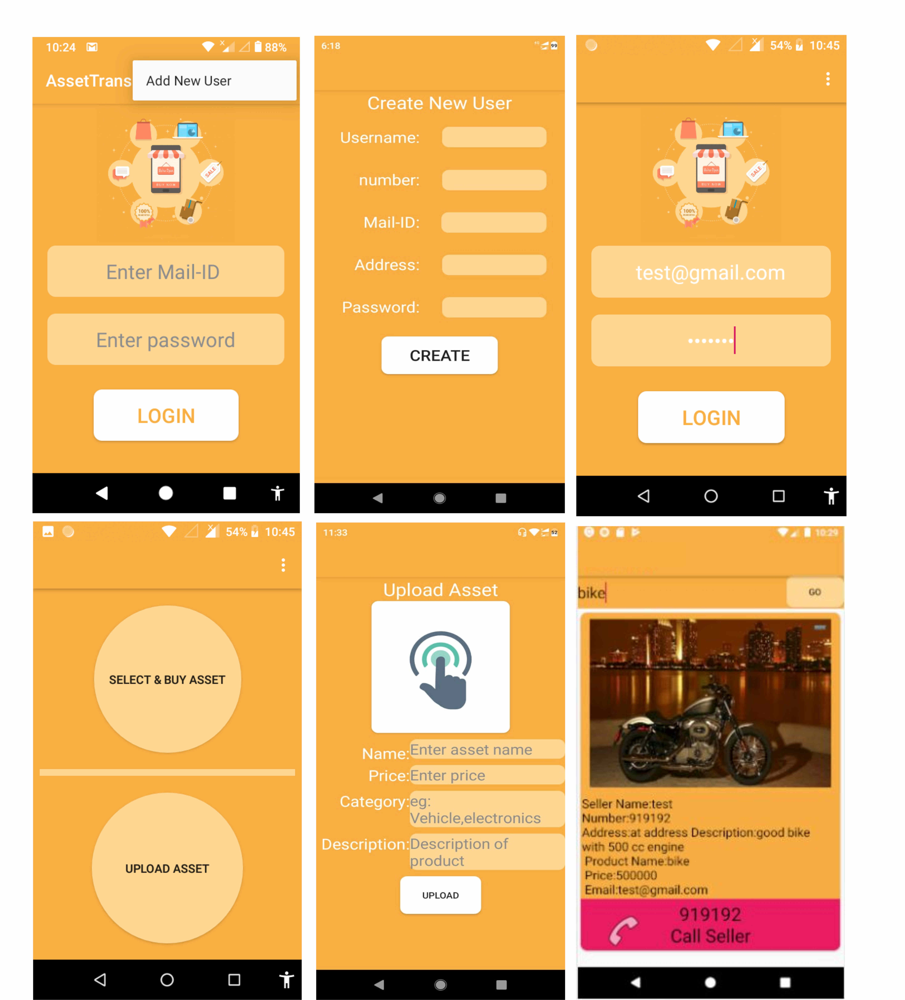

# Online-Marketplace-Android-project
<b>Description:-</b>  
Two parties which are interested in transferring or selling or buying asset with safe way can use this system. Simply we can say that seller can sell his/her asset and customer can buy asset according to need.  
 <b>Steps to use:-</b>  
1.Go to option and press "add new user", fill the form and press "Create"  
2.Enter email and password press "Login".  
3.Now seller can see two buttons clicking on "Upload asset" will forward you to "Uplolad Asset" activity, after clicking on "upload" theses details will be uploaded to realtime database.  
4.Then customer can see the products they want by typing things they want on textfield and by pressing "Go" button and can press the button "call seller" to call the seller.   
(In the case of customer also he/she needs to create new account and do login before accessing products/things they want.  
<b>Screenshots:-</b>  

<b>IDE:-</b>  
  Andorid studio  
<b>Database used:-</b>  
  Google firebase realtime database  
<b>Programming language:-</b>  
  Java
  
